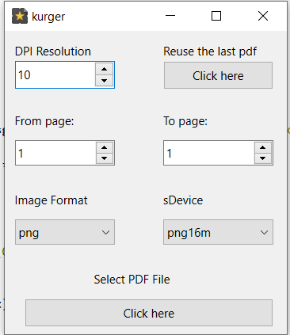

[](https://github.com/su8/kurger/actions/workflows/flawfinder.yml)

qt6 -  qt5 - 

**kurger** is a small and open source graphical application written in C++ and designed to act as a quick solution for converting PDF files to image files.

**kurger** features support for four different image formats, including PNG, JPG, BMP, and TIFF, as well as support for ten Ghostscript devices, including png16m, pngalpha, pnggray, jpeg, jpegcmyk, jpeggray, bmp16m, bmpgray, tiff24nc, and tiffgray.

Before the actual conversion, users will be able to set the resolution of the output image, as well as to specify the pages they want to convert. The software can convert multiple PDF pages at once, into multiple images, with a single mouse click.

**kurger_cli.cpp** is command line interface version that wokrs in linux, bsd and windows like it's GUI version.


## Installation

This is the **Qt6/5** version of https://github.com/su8/pdf2img-c. Look at the bottom if you want to use the program on **Linux/\*BSD**. If on **Windows** you'll need to download and install Qt - [Qt installer](https://www.qt.io/cs/c/?cta_guid=074ddad0-fdef-4e53-8aa8-5e8a876d6ab4&signature=AAH58kEJJxpduKtfibJ40aRNSB4V5QaI1A&pageId=12602948080&placement_guid=99d9dd4f-5681-48d2-b096-470725510d34&click=559deaff-10e4-44a7-a78c-ef8b98f3c31a&hsutk=&canon=https%3A%2F%2Fwww.qt.io%2Fdownload-open-source&portal_id=149513&redirect_url=APefjpGq5H2gLEy0rkYfu04Stc7zjmm0KqS_XaAVoOUeI1pUOzGQZgD_zg87kf-KWNMA8LagnlFie8sOAzzTMW8z48C4QlIP08Ykoqpk2QaLznoki0aaOBah-YfMzg2wugOl_TcZQF2S) and install Qt **manually** from the GUI installer.

After that import all project files in **Qt Creator** and compile with **CTRL + r**. From now on, you can use the compiled **kurger** executable to convert pdf files to images.

You'll also need to install [Ghostscript](https://ghostscript.com/releases/gsdnld.html). Install Ghostscript into **C:\gs** if on **Windows**, else install it in **/usr/bin** if you choose manual installation instead using your package manager.

---

If on **Linux/\*BSD** compile with:

```bash
cmake .
make -j8 # 8 cores/threads to use in parallel compile
sudo/doas make install

# to uninstall it
sudo make uninstall
```

---

## Windows users

Tested with [Visual Studio Code Editor](https://code.visualstudio.com/download), but you need to install [MingW](https://github.com/niXman/mingw-builds-binaries/releases/download/12.2.0-rt_v10-rev0/x86_64-12.2.0-release-posix-seh-rt_v10-rev0.7z), once downloaded extract it to **C:\MingW**, then re-open [Visual Studio Code Editor](https://code.visualstudio.com/download), you might want to install C\C++ extensions if you plan to write C\C++ code with the editor. If you plan to contribute to this project go to **File->Preferences->Settings** and type to search for **cppStandard** and set it to c17 to both C++ and C.

I use **One Monokai** theme for the [VScode Editor](https://code.visualstudio.com/download)

In [Visual Studio Code Editor](https://code.visualstudio.com/download), go to **Terminal->Configure Tasks...->Create tasks.json from template** and copy and paste this into it:

```json
{
  "version": "2.0.0",
  "tasks": [
    {
        "type": "cppbuild",
        "label": "C/C++",
        "command": "C:\\MingW\\bin\\g++.exe",
        "args": [
            "-fdiagnostics-color=always",
            "-std=c++17",
            "-ggdb",
            "-lpthread",
            "-Wall",
            "-Wextra",
            "-O2",
            "-pipe",
            "-pedantic",
            "-Wundef",
            "-Wshadow",
            "-W",
            "-Wwrite-strings",
            "-Wcast-align",
            "-Wstrict-overflow=5",
            "-Wconversion",
            "-Wpointer-arith",
            "-Wformat=2",
            "-Wsign-compare",
            "-Wendif-labels",
            "-Wredundant-decls",
            "-Winit-self",
            "${file}",
            "-o",
            "${fileDirname}/${fileBasenameNoExtension}"
        ],
        "options": {
            "cwd": "C:\\MingW\\bin"
        },
        "problemMatcher": [
            "$gcc"
        ],
        "group": {
            "kind": "build",
            "isDefault": true
        },
        "detail": "compiler: C:\\MingW\\bin\\g++.exe"
    }
]
}
```

To convert some pdf file with the above script, right click and `copy as path` the pdf book, then right click it in the opened window and remove the quotes in both sides.

### To compile the kurger_cli.cpp press **CTRL** + **SHIFT** + **B** , then from the same Desktop folder start the `kurger_cli.bat` script. Now you can delete the "kurger_cli.exe" file

Optioanlly if you want to play the game from VSCode's console -- wait until it compiles, after that press **CTRL** + **\`** and paste this `cp -r C:\Users\YOUR_USERNAME_GOES_HERE\Desktop\main.exe C:\MingW\bin;cd C:\MingW\bin;.\main.exe from 5 to 10 resolution 100 file book.pdf`